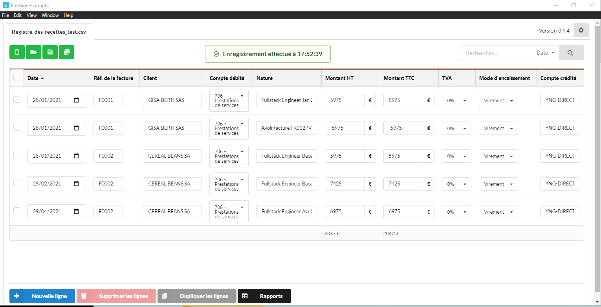
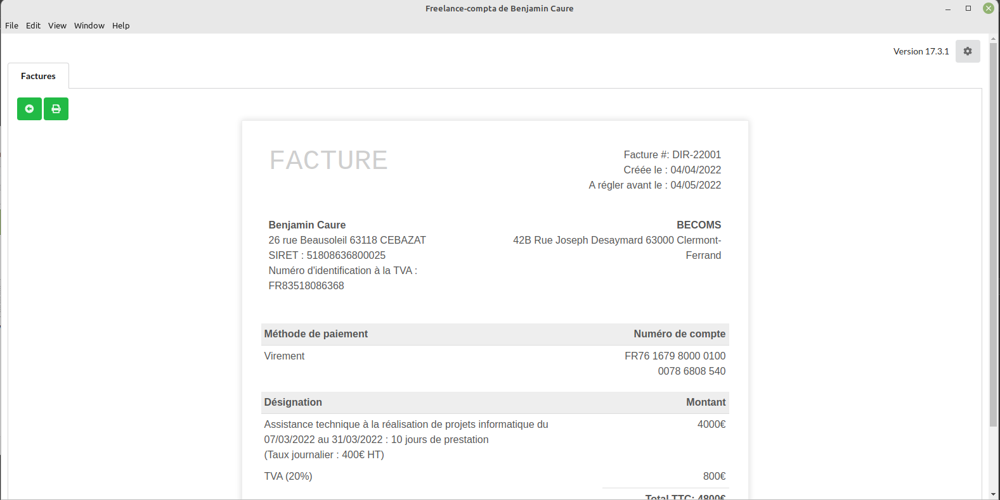

# Comptabilité et facturation pour Micro-Entreprise sous Linux et Windows

Les logiciels de comptabilité et de facturation constituent le minimum pour être **conforme à la réglementation française** des micro-entreprises.
Les données sont enregistrées en CSV et PDF.
Idéal pour les freelances qui souhaitent une base simple (**React.js**) à personnaliser.





# Quick start

Télécharger la dernière release depuis [Github](https://github.com/freelance-info/freelance-softwares/releases)

 - Windows : 
   - copier *freelance_compta.exe* et *freelance_compta.exe* dans un répertoire (autre que *Téléchargements").
   - exécuter les fichiers; étant donné qu'ils ne sont pas signés, cliquer sur "en savoir plus" puis "exécuter quand même"
 - Linux:
   - Télécharger et exécutés avec les fichiers **.appImage* ([?](https://docs.appimage.org/introduction/quickstart.html#ref-quickstart))

# Module Comptabilité

## 1ère obligation légale : le _Livre des recettes_

Le fonctionnement reste très proche d'une feuille Excel avec :
- une aide à la saisie pour les clients / objets de prestation / mode de règlement
- une sélection de facture émises pour remplir automatiquement les lignes de compte

Source : [site du gouvernement](https://www.service-public.fr/professionnels-entreprises/vosdroits/R54994) :

## 2ème obligation légale : le _Registre des achats_

Obligatoire uniquement pour les micro-entreprise de vente et de location.
Il fonctionne de la même façon que le livre des recettes et comporte une sélection de facture reçue.

## 3ème obligation légale : les _Factures émises et reçues_ 

Ce logiciel est fait pour fonctionner avec des factures émises de façon externes, par tout type de logiciel et notamment son cousin :
https://github.com/freelance-info/factures

Pour plus de souplesse, il se base sur un nommage des factures normé pour déduire la date, le client et le n° de facture.
Chaque ligne comptable lié à une facture conservera une référence vers le chemin du fichier.

## Les documents à produire

- Déclaration 2035
- Déclaration de TVA Cerfa 3310 (régime réél) ou 3517 (régime simplifié)
- Télétransmission de la liasse fiscale à votre AGA

# Module Facuration

## Les _Factures émises et reçues_ 

Le modèle contient toutes les mentions légales minimales:
- La date de la facture
- Le numéro de la facture
- La date de la vente ou de la prestation de service
- La dénomination sociale (ou nom et prénom pour un entrepreneur individuel),
- L'adresse du siège social et l'adresse de facturation (si différente),
- Le numéro de Siren ou Siret, le code NAF, la forme juridique et le capital social (pour les sociétés), le numéro RCS et ville du greffe d'immatriculation (pour les commerçants), le numéro au répertoire des métiers et département d'immatriculation (pour les artisans).
- L'identité de l'acheteur ou du client
- Le numéro du bon de commande uniquement s'il a été préalablement émis par l'acheteur.
- Le numéro d'identification à la TVA
- La nature, marque, et référence des produits doivent être mentionnés ainsi que les matériaux fournis et la main d'oeuvre pour les prestations.
- Le prix catalogue
- Le taux de TVA légalement applicable
- L'éventuelle réduction de prix
- La somme totale à payer hors taxe (HT) et toutes taxes comprises (TTC)
- L'adresse de facturation mais uniquement si elle est différente de celle du siège social de l'entreprise.
- La date à laquelle le paiement doit intervenir ou le délai de paiement
- Les conditions d'escompte en cas de paiement anticipé
- Les taux de pénalités en cas de non paiement ou de retard de paiement (40 €).
- L'existence et la durée de la garantie légale de conformité de deux ans pour certains biens

Le formulaire propose une aide à la saisie pour la plupart des champs.
L'export se fait sous forme d'un template .pdf.
Vous pouvez également joindre le scan d'une facture ou d'un ticket de caisse.

## Sauvegarde des données

Les données sont stockées sous forme de fichiers CSV, afin que vous puissiez les exploiter facilement avec un autre logiciel.
Vous pouvez aussi les sauvegarder très facilement sur le support de votre choix (dropbox, clé usb, etc.).
Selon votre volume d'activité, c'est vous qui choisissez comment découper vos fichiers : 1 fichier par mois, 1 fichier par année, etc.


# Développement

## Local

1. Installer [les prérequis Python pour node-gyp](https://github.com/nodejs/node-gyp#Installation).

Exemple pour Windows : depuis un terminal en admin 

```
npm install --global --production windows-build-tools
```

2. Installer les dépendances : `npm install`

3. Lancer le module **common** : 

```
cd common
npm dev
```

4. Lancer un module à la fois 

    4.1. module de comptabilité :

    ```
    cd compta
    npm run start
    ```

    4.2. module de facturation :

    ```
    cd facture
    npm run start
    ```

## Packaging

1. Augmenter le numéro de version dans `package.json`

2. `npm run build:electron`: création des fichiers javascript de production

3. `npm dist:win`, `npm dist:linux` et `npm dist:mac` : création des exécutable d'installation

